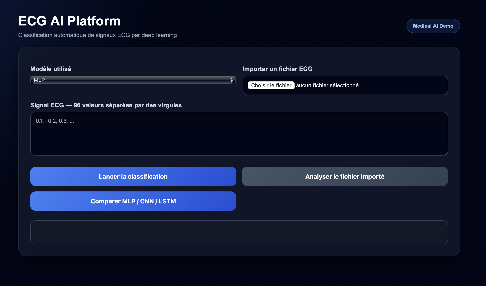
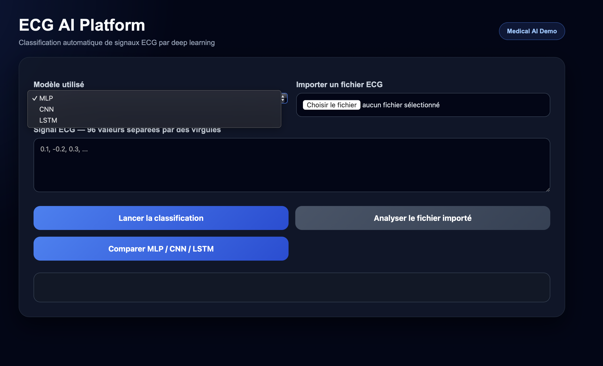
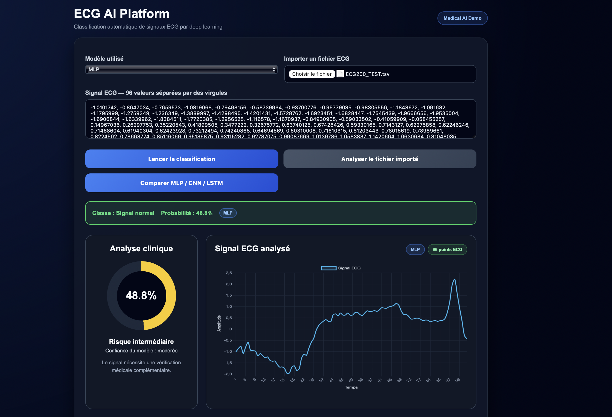
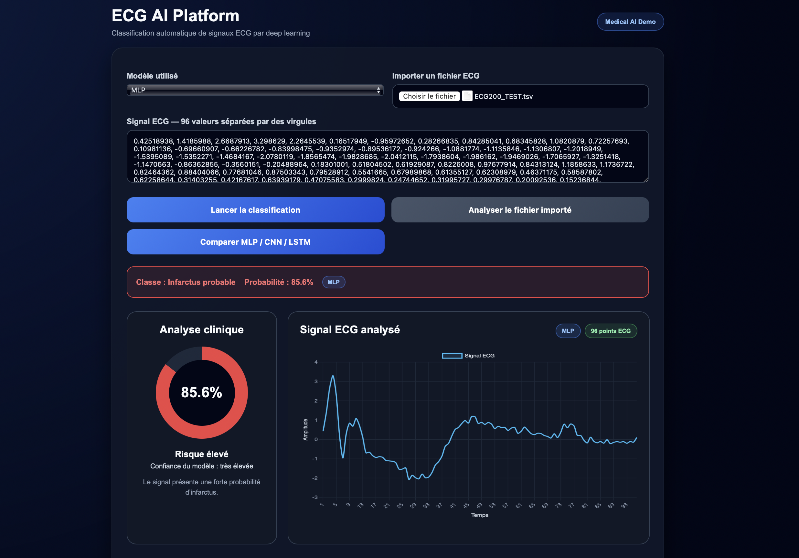

#  ECG AI Platform

Application web de classification de signaux électrocardiographiques (ECG) permettant de détecter la présence potentielle d’un infarctus du myocarde à l’aide de modèles de Deep Learning.

Le projet repose sur une architecture microservices conteneurisée combinant une application Java Spring Boot et un service d’inférence Python utilisant TensorFlow/Keras.

---

#  Aperçu de l'application

## Détection d'un signal ECG normal

Le modèle identifie ici un signal ECG normal et affiche son analyse clinique ainsi que sa représentation graphique.

---

## Détection d'un infarctus probable

Le système détecte ici un infarctus probable avec une forte confiance et met automatiquement à jour le niveau de risque clinique.

---

#  Lancer le projet

## Prérequis

- Docker
- Docker Compose

Vérification :

docker --version
docker compose version

## Linux / macOS

chmod +x go.sh
./go.sh

## Alternative

docker compose up --build

---

#  Accès à l'application

Une fois les conteneurs démarrés :

http://localhost:8081

---

#  Fonctionnalités

## Classification individuelle

- Sélection du modèle de Deep Learning :
  - MLP
  - CNN 1D
  - LSTM

- Saisie manuelle d'un signal ECG de 96 points

- Classification automatique :
  - Signal normal
  - Infarctus probable

- Affichage du score de confiance

- Affichage du modèle utilisé

---

## Tableau de bord médical interactif

Après chaque prédiction :

- Jauge de risque clinique
- Niveau de risque :
  - Faible
  - Intermédiaire
  - Élevé

- Diagnostic textuel automatique
- Indication de la confiance du modèle
- Nombre de points ECG analysés

---

## Visualisation du signal ECG

L'application génère automatiquement :

- Courbe ECG interactive
- Visualisation des 96 points du signal
- Affichage du modèle utilisé
- Interface responsive moderne

---

## Analyse de fichiers

Formats supportés :

- `.csv`
- `.tsv`

Fonctionnalités :

- Détection automatique des signaux valides
- Analyse batch de plusieurs ECG
- Affichage des résultats ligne par ligne
- Sélection d'un signal depuis le tableau pour réanalyse individuelle

---

## Comparaison des modèles

L'application permet de comparer automatiquement les performances des trois architectures sur un même signal ECG.

| Modèle | Classe prédite | Probabilité |
|---------|---------|---------|
| MLP | Normal / Infarctus | % |
| CNN | Normal / Infarctus | % |
| LSTM | Normal / Infarctus | % |

Le meilleur score est automatiquement mis en évidence.

---

#  Modèles utilisés

## MLP

Multi-Layer Perceptron utilisant plusieurs couches entièrement connectées.

### Avantages

- Rapide à entraîner
- Faible complexité
- Très bonnes performances sur ECG200

---

## CNN 1D

Réseau de neurones convolutif spécialisé pour les séries temporelles.

### Avantages

- Extraction automatique de motifs locaux
- Détection efficace des formes ECG caractéristiques

---

## LSTM

Réseau récurrent capable de modéliser les dépendances temporelles.

### Avantages

- Prise en compte de la dynamique temporelle du signal
- Adapté aux données séquentielles

---

#  Jeu de données

Dataset utilisé :

**ECG200 (UCR Time Series Classification Archive)**

Caractéristiques :

- Classification binaire
- 96 points par signal
- 200 signaux ECG
- Classes :
  - Normal
  - Infarctus

Répartition :

- 100 échantillons d'entraînement
- 100 échantillons de test

---

#  Déploiement Docker

Le projet est entièrement conteneurisé.

## Application Java

- Java 17
- Spring Boot
- Interface utilisateur
- API REST

## Service IA Python

- Python 3
- TensorFlow
- Keras
- NumPy
- Scikit-Learn

## Lancement

docker compose up --build

---

#  Résultats retournés

Pour chaque signal ECG :

- Classe prédite
- Probabilité associée
- Niveau de risque
- Diagnostic textuel
- Visualisation du signal
- Comparaison éventuelle entre modèles

---

#  Stack technique

## Backend

- Java 17
- Spring Boot
- Maven

## Intelligence Artificielle

- Python 3
- TensorFlow
- Keras
- NumPy
- Scikit-Learn

## Frontend

- HTML5
- CSS3
- JavaScript
- Chart.js

## Déploiement

- Docker
- Docker Compose

---

#  Objectifs du projet

- Développer une plateforme médicale basée sur l'IA
- Comparer plusieurs architectures de Deep Learning
- Déployer une architecture microservices conteneurisée
- Fournir une interface utilisateur intuitive pour l'analyse ECG
- Illustrer l'intégration entre Java Spring Boot et Python TensorFlow

---

#  Auteur

**Erwan Vangu**

Étudiant ingénieur en Informatique, Data Science et Intelligence Artificielle

**ENSISA – École Nationale Supérieure d’Ingénieurs Sud Alsace**

